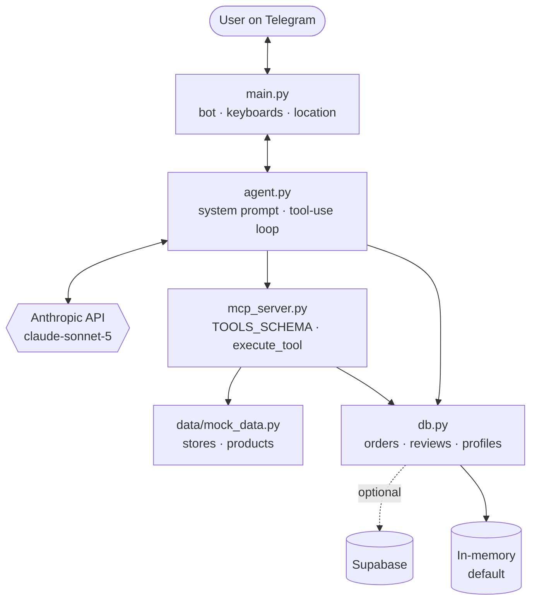

# 🛒 ShopBot — AI Home Appliance Advisor

A Telegram bot that helps you choose a home appliance and find a nearby store
that carries it. Built on the Anthropic API with an MCP-style tool layer: Claude
decides which tools to call, the tools query the catalog, and the agent turns the
results into a recommendation.

> **This is a portfolio project.** The catalog, stores, stock and orders are
> realistic demo data, not a real retailer — see [Demo data](#demo-data).

---

## Status

All five layers are implemented. The catalog, storage and tool layers are
verified by direct execution — filtering, distance math, order validation and
every error path. The bot itself is live and connects to Telegram with real
credentials; onboarding (buttons, greeting) auto-localizes to the user's
Telegram language and has been confirmed working in Hebrew. A full
conversation walkthrough (recommendations, orders, reviews) and README
screenshots are still pending.

Full breakdown, including what is and isn't verified, in
[`Docs/TODO.md`](Docs/TODO.md).

---

## What it demonstrates

- **An AI agent with tool use** — a system prompt plus a tool-use loop against
  the Anthropic API ([`agent.py`](agent.py))
- **An MCP-style tool layer** — 10 tools behind a schema and a dispatcher
  ([`mcp_server.py`](mcp_server.py))
- **Conversational onboarding** — inline keyboards and GPS location sharing
  ([`main.py`](main.py))
- **A pluggable storage layer** — in-memory by default, Supabase when configured
  ([`db.py`](db.py))
- **Prompt caching** — a split system prompt that keeps the cacheable prefix stable

## Features

- 💬 Natural conversation in any language — the bot replies in the language you write in
- 🌐 Onboarding (buttons, greeting) auto-localizes to Hebrew or English based on your Telegram language
- 🧠 Recommendations matched to your need, budget, brand and rating preferences
- 📍 Finds nearby stores from shared GPS coordinates, or by city name
- 🛒 Places orders, with validation that the store actually carries the product
- ⭐ Saves and retrieves user reviews
- ⚡ Answers general appliance questions (specs, energy ratings) without tools

---

## Architecture



**The request path:** a Telegram message reaches `main.py`, which passes it to
`agent.py`. The agent sends the conversation to Claude along with the tool
schema. If Claude requests tools, `mcp_server.py` executes them against the
catalog and storage layer, the results go back into the loop, and the agent
repeats until Claude produces an answer.

The layers stay decoupled: the bot knows nothing about products, and the tools
know nothing about Telegram. Swapping either one touches a single file.

| File | Responsibility |
|---|---|
| [`main.py`](main.py) | Telegram: polling, onboarding, keyboards, location |
| [`agent.py`](agent.py) | System prompt, tool-use loop, error handling |
| [`mcp_server.py`](mcp_server.py) | Tool definitions + dispatcher |
| [`db.py`](db.py) | Storage: in-memory or Supabase |
| [`data/mock_data.py`](data/mock_data.py) | The catalog — the only file to swap for real data |

More detail in [`Docs/ARCHITECTURE.md`](Docs/ARCHITECTURE.md).

---

## Setup

You need Python 3.10+ and two free credentials.

### 1. Install

```bash
git clone https://github.com/NimrodAltman/shop-bot.git
cd shop-bot
pip install -r requirements.txt
```

### 2. Configure

```bash
cp .env.example .env
```

Fill in two values:

| Variable | Where to get it |
|---|---|
| `TELEGRAM_TOKEN` | Message [@BotFather](https://t.me/BotFather) → `/newbot` → copy the token |
| `ANTHROPIC_API_KEY` | [console.anthropic.com](https://console.anthropic.com) → API Keys |

`SUPABASE_URL` and `SUPABASE_KEY` are optional — leave them empty and the bot
runs on in-memory storage.

### 3. Run

```bash
python main.py
```

Open your bot in Telegram and send `/start`.

### Commands

| Command | Does |
|---|---|
| `/start` | Guided onboarding: category → budget → location |
| `/help` | What the bot can do |
| `/reset` | Clear the conversation, keep your profile |

---

## Demo data

The catalog in [`data/mock_data.py`](data/mock_data.py) is **demo data**:
6 stores and 11 products with realistic specs, prices, ratings and energy
ratings. Orders are recorded but nothing is actually purchased.

This is a deliberate choice, not a shortcut. The point of the project is the
agent architecture, and mock data keeps it runnable by anyone who clones it —
no scraping, no API keys for a retailer, nothing to break when a website
changes. `mock_data.py` is the only module that talks to raw data; every other
layer calls its accessor functions. Connecting a real catalog means
reimplementing that one file with the same function signatures.

See [`Docs/DATA_MODEL.md`](Docs/DATA_MODEL.md) for the shapes.

---

## Storage

Runs on in-memory dicts by default — clone, add two env vars, run.

Set `SUPABASE_URL` **and** `SUPABASE_KEY` and `db.py` switches to Supabase
automatically, so users, orders, reviews and chat history survive restarts. If
the client can't be created, it falls back to in-memory rather than crashing.
Table SQL is in [`Docs/DATA_MODEL.md`](Docs/DATA_MODEL.md).

---

## Tech stack

| | |
|---|---|
| **AI** | Anthropic API — `claude-sonnet-5`, adaptive thinking, tool use |
| **Channel** | Telegram (`python-telegram-bot` 22.x) |
| **Storage** | In-memory dicts / Supabase |
| **Language** | Python 3.10+ |

Telegram was chosen over WhatsApp deliberately: no per-message cost, no business
verification, no 24-hour messaging window, and richer UI primitives (inline
keyboards, native location sharing). The channel is one file — the agent, tools
and storage are unchanged by that choice.

---

## Docs

| Document | Contents |
|---|---|
| [`Docs/ARCHITECTURE.md`](Docs/ARCHITECTURE.md) | Layer design, the tool-use loop, prompt caching, design decisions |
| [`Docs/DATA_MODEL.md`](Docs/DATA_MODEL.md) | Data shapes, the tool reference, Supabase schema |
| [`Docs/DEPLOYMENT.md`](Docs/DEPLOYMENT.md) | Running locally and deploying to Railway |
| [`Docs/TODO.md`](Docs/TODO.md) | Status, what's verified, roadmap, known limitations |

---

## License

MIT
